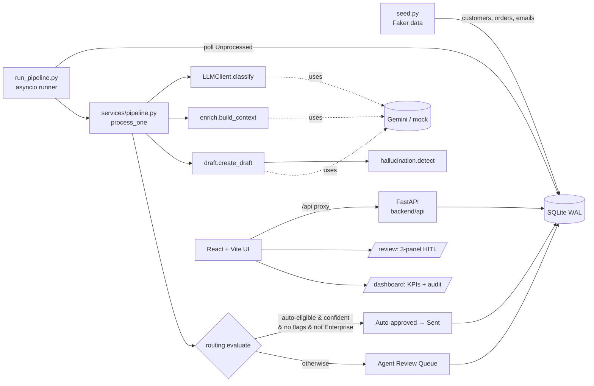
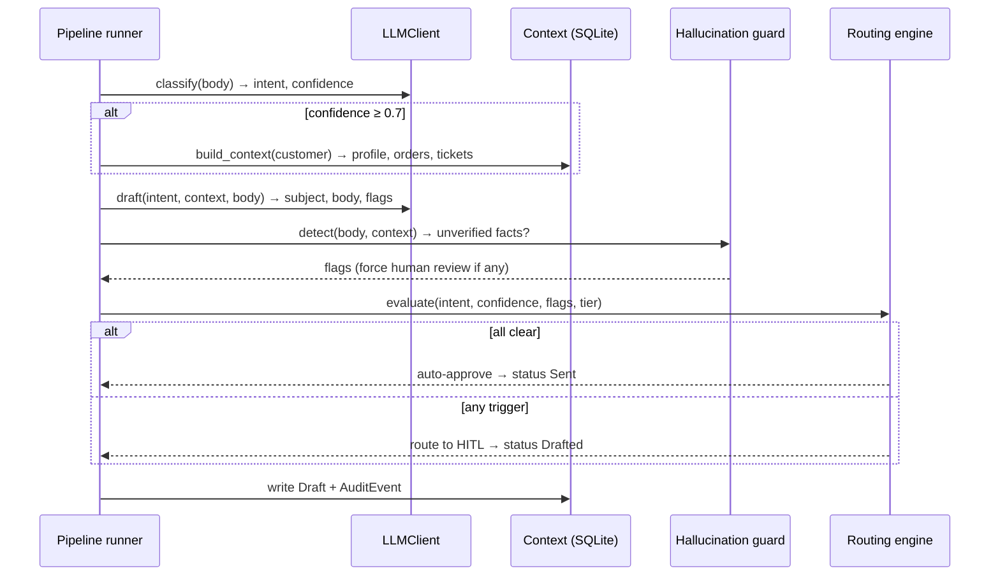

# SmartSupport — AI Email Automation

A fully-coded, end-to-end AI customer-support pipeline, built as a study/portfolio project.
Synthetic support emails are **classified**, **enriched** with customer/order context,
**drafted** by an LLM, then **routed** either to an automatic reply or to a human reviewer
(HITL) who approves, edits, or rejects the draft in a browser UI. Every action is recorded in
an audit trail and surfaced on a manager dashboard.

No no-code tools, no live email server, no real CRM — every layer is simulated in code so the
whole system is transparent and inspectable.

> **Status: feature-complete (M0–M4).** Backend pipeline, React Agent Review UI, manager
> dashboard, hallucination guard, eval harness, and a 27-test suite (~91% coverage) all working.

---

## What it solves

Support agents spend a large share of their day reading, tagging, and typing repetitive
replies. SmartSupport automates the routine path end-to-end while keeping a human in control of
anything risky or low-confidence — demonstrating an AI-first support workflow that's safe by
design (every high-stakes reply is reviewed before "send").

## Architecture



The API endpoints and the pipeline runner call the **same service functions**
(`classify`, `build_context`, `create_draft`, `evaluate`), so what an agent sees in the UI is
exactly what the pipeline produced — the two can never drift.

## Pipeline flow (per email)



### When does an email need a human? (HITL triggers — PRD §7.2)

An email is routed to the review queue if **any** of these is true; otherwise it's
auto-approved:

- intent is **Technical Support** or **Refund Request** (never auto-replied)
- classification **confidence < 0.85**
- the model **flagged its own draft** for review
- the draft has **any flags** (e.g. high-value refund, legal language, possible hallucination)
- the customer is **Enterprise tier**

## Tech stack

| Layer | Choice |
|---|---|
| Backend API | FastAPI + uvicorn (docs at `/docs`) |
| Pipeline | Python `asyncio` runner |
| LLM | Google Gemini free tier via a provider-agnostic, mockable client |
| DB / ORM | SQLite (WAL) + SQLAlchemy + Alembic |
| Seed data | Faker (deterministic, fixed seed) |
| Frontend | React + Vite + TypeScript, `react-router`, `jsdiff` |
| Tests | pytest + httpx (in-memory SQLite) |
| Logging | structlog (JSON; every LLM call: latency, tokens, model, stage) |
| Quality | Ruff + Black + mypy (pre-commit config provided) |

## Setup

1. `python -m venv .venv` then `.venv\Scripts\activate`
2. `pip install -r requirements.txt`
3. Copy `.env.example` to `.env`. For offline work, leave `MOCK_LLM=true` (**no key needed**).
   For live LLM calls, get a **free** key at https://ai.google.dev (Google account, no credit
   card) and set `GEMINI_API_KEY`, then set `MOCK_LLM=false`.
4. Frontend (first time): `cd frontend && npm install`

> **Free-tier quota note:** the Gemini free tier limits requests per day, and the limit varies
> by model. If you hit `429 RESOURCE_EXHAUSTED`, either wait for the daily reset (midnight
> Pacific) or switch to a higher-allowance model by changing `GEMINI_MODEL` in `.env` — e.g.
> `gemini-2.5-flash-lite` (~1,000/day) or `gemini-2.0-flash` (~1,500/day). It's a one-line change.

## Running it

| Command | What it does |
|---|---|
| `seed.bat` | Populate SQLite with 50 customers / 150 orders / 200 labelled emails |
| `run-pipeline.bat` | Process all waiting emails once (classify → draft → route). `run-pipeline.bat loop` polls forever |
| `run-backend.bat` | Start the API at http://localhost:8000 (`/docs` for interactive API) |
| `run-frontend.bat` | Start the Agent Review UI at http://localhost:5173 |

**Typical demo:** `seed.bat` → `run-pipeline.bat` → start `run-backend.bat` and
`run-frontend.bat` in two terminals → open http://localhost:5173. Review drafts on the
**Agent Review** tab; watch KPIs on the **Dashboard** tab.

**Mail Intake (live feed):** on the **Mail Intake** tab, drag-and-drop real complaint files —
Outlook `.msg`, Gmail `.eml`, PDFs, or images/screenshots. The system reads each one (text files
locally; images & scanned PDFs via Gemini vision), files it as an inbox email, and runs it
through the pipeline so its AI draft appears in the review queue. Agents can only review — issues
enter the system as files, never by typing. `seed.bat --append` adds synthetic unprocessed emails
without wiping existing history (an accumulating inbox).

## Tests & evaluation

- `.venv\Scripts\python -m pytest` — 27 tests, all in mock mode (no key, no network).
- `.venv\Scripts\python -m pytest --cov=backend` — coverage report (~91%).
- `.venv\Scripts\python scripts\eval.py` — classification accuracy vs. ground-truth labels.
  Mock mode scores ~83%; a live Gemini run targets ≥90% (PRD KPI).

## Project structure

```
backend/
  api/         FastAPI routes (classify/context/draft/metrics, drafts queue+action)
  services/    llm_client, enrich, draft, routing, hallucination, pipeline, metrics
  models/      SQLAlchemy ORM (Customer, Order, SimulatedEmail, Draft, AuditEvent)
  config.py    typed settings from .env      db.py  engine + WAL + session
  schemas.py   Pydantic request/response models      main.py  FastAPI app
frontend/      React + Vite UI (pages/Review, pages/Dashboard, components, api.ts)
scripts/       seed.py, run_pipeline.py, eval.py
tests/         pytest suite + fixtures (in-memory SQLite)
alembic/       migrations
data/          SQLite database file (gitignored)
```

## Environment variables

See `.env.example` for the full annotated list (provider, model, mock toggle, rate limits, DB URL).

## Key design decisions

- **Gemini free tier as the LLM, behind a provider-agnostic client.** Genuinely free (no card),
  native JSON output, OpenAI-compatible. The client hides the provider, so switching to Groq,
  Grok, or any OpenAI-compatible API is a one-line `.env` change (`LLM_PROVIDER`). *(This swaps in
  for the PRD's original Grok choice; the swap-ability rationale is preserved.)*
- **A real mock mode, not just stubs.** `MOCK_LLM=true` uses a keyword classifier + template
  drafter, so the entire pipeline, UI, dashboard, and test suite run offline with no API key.
  Live calls are reserved for demos and the eval harness.
- **Two-stage prompt chain (classify, then draft).** Separate calls keep intermediate state
  inspectable and reduce hallucination risk; each prompt can be tuned independently.
- **SQLite in WAL mode.** Zero-setup, single-file, easy to seed/reset/inspect; WAL + a write lock
  let the async runner and API share it without contention.
- **Logic lives in services, not in routes or the runner.** Endpoints and the pipeline both call
  the same functions, so behavior stays consistent and is unit-testable in isolation.
- **Defense in depth on hallucinations.** Beyond instructing the model to use only context
  facts, a post-processor flags any unverified amount/order/tracking in the draft and forces
  human review.

## Running with Docker (optional)

The `.bat` scripts are the primary way to run the app on Windows. For a one-command,
machine-independent start, Docker is also provided:

```
docker compose up --build
```

This builds two containers — the FastAPI backend (which auto-migrates and seeds a demo dataset
on first run) and the Vite UI — then serves the API on http://localhost:8000 and the UI on
http://localhost:5173. It defaults to **mock LLM mode** (no key). To use real Gemini, uncomment
`GEMINI_API_KEY` and set `MOCK_LLM=false` under the `backend` service in `docker-compose.yml`.

> Note: the Docker setup is provided for portability/portfolio completeness and is best-effort —
> the `.bat` workflow is the tested path.

## Out of scope

Live IMAP/SMTP, real CRM/payment integrations, and multi-tenant deployment are intentionally out
of scope for this study build.
